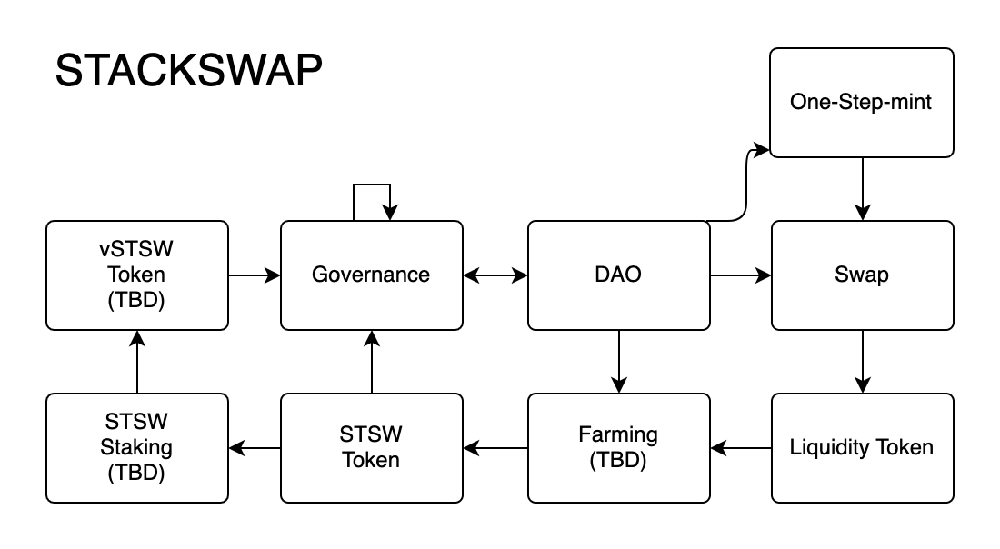

# STACKSWAP: DEX meets token launchpad on Stacks

Stackswap is a combination of DEX and token launchpad on Stacks blockchain. You can buy/sell tokens or list your own token without having any coding skills. We've side-stepped the issue of Clarity missing a function akin to CREATE2 of Solidity by deploying template tokens before 'instantiation', which allows anyone to list their own token on DEX without communicating with the operating party. Kudos to all the amazing Clarity developers who allowed us to stand on the shoulders of giants. 

### Core Concepts
#### Swaps
The current Swap functionalities are almost identical to Swapr, which is a clone of Uniswap V2. We plan to introduce more sophisticated AMM on next iteration.
#### Pools
The Liquidity Providers(LPs) provide token liquidity to the pool and allow traders to trade. LPs supply liquidity to pools and receive LP tokens issued with protocols in return. The LP token is a transferable token that is paid in proportion to the amount that contributes to the liquidity pool. 
#### Token launchpad
Allows 1-step minting of SIP-10 and PoXL tokens.  
#### Farming
The liquidity provider receives the reward tokens based on the contribution to the liquidity supply provided. Reward tokens per each block are allocated according to the weighted average liquidity value that considers the amount of time the token is held.
#### DAO/Governance
Can control STSW supply. Voting with STSW and vSTSW(todo). 


## STACKSWAP Contract Structure



## How to run
1. Run on Clarinet

    ```bash
    git clone [this project]
    cd [this project]
    cd clarinet 
    clarinet console
    ```
2. Deploy to testnet / mainnet
    ```bash
    git clone [this project]
    cd [this project]
    cp .env.sample.env .env
    vi .env
    npm install
    node deploy.js
    ```

## Future Works
Multiple AMM choices /
Create Farming Pool /
Connect advance trading funcionalities /
Advanced governance features


